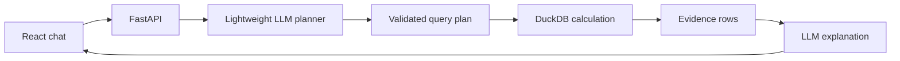

# TBX Finance Assistant

An AI assistant for asking plain-language questions about financial operations data and receiving accurate, traceable answers. Built for the **TBX - BVP Tech Catalyst Hackathon**.

> **Dataset status:** TBX will provide the starter dataset when teams meet. No private or invented sample data is committed here. The ingestion layer discovers CSV names and columns at runtime, so the provided files can be added without redesigning the application.

## What the starter already supports

- Free-form chat with multi-turn history
- Runtime upload and schema discovery for CSV datasets
- Model-generated structured query plans constrained to real datasets and columns
- Deterministic filtering, grouping and aggregation with DuckDB
- Plain-language explanations generated only after computation
- Evidence tables containing the underlying records or breakdown
- CSV export for every computed result
- Explicit clarification instead of fabricated figures
- Confidence signalling based on whether matching evidence exists
- Mock mode for developing without API credits
- Replaceable model provider, initially wired for Sarvam AI

The expected TBX resources include transactions, vendor payouts, reconciliation status, chart of accounts, vendor list and a data dictionary. Their precise schemas are intentionally not assumed.

## Included synthetic demo data

`data/sample/` contains a small, deterministic finance-operations dataset with the same resource categories named by TBX. It is entirely synthetic and is loaded by default through `DATA_DIRECTORY=data/sample`.

Try these immediately in mock mode:

- `How much did we spend on vendor payouts last month?` - computes INR 958,750 from August 2026 payout rows.
- `Which transactions are unreconciled?` - returns the two matching source transactions.
- `Break down unreconciled spend by vendor.` - returns a vendor-level computed breakdown.

Mock mode uses a deliberately small rule-based planner for these acceptance paths. It exists for local plumbing tests, not as the final natural-language model.

## Grounded request flow



The language model never calculates totals. It maps the question to a constrained `QueryPlan`; the backend validates dataset and column names, parameterizes filter values, runs the calculation, and only then asks the model to explain the evidence.

## Grounding guardrails

Refusal does not depend on the model volunteering `{"clarification": ...}`.
Under the lightweight-model constraint the planner is small and eager to produce
*something*, so these guards refuse structurally, before any model call — which
means an unanswerable question also costs zero tokens.

| Guard | Fires when | Cost |
|---|---|---|
| Unsupported subject | the question uses words that are neither query language nor present in the data | 0 tokens |
| Forecasting | the question asks about the future | 0 tokens |
| Unknown named entity | a capitalised name appears nowhere in the loaded data | 0 tokens |
| Plan validation | the model emits an unknown dataset, column or operation | 1 call |
| Empty result | no rows match — reported as an honest zero, `confidence: low` | 1 call |

The vocabulary is derived from the live catalog at runtime (column names plus the
distinct values of low-cardinality text columns), never hardcoded, so it adapts
to the TBX dataset automatically. A word that genuinely appears in the data —
`payroll` is a real category in the sample — is not a refusal trigger.

Without the named-entity guard, *"How much did we pay Globex Corporation last
month?"* silently drops the unknown vendor and returns the total for **every**
vendor. A confidently wrong number is the failure mode the brief calls a
liability.

## One model call per question

The planner call is the only model call. The answer sentence is generated from
the computed evidence by `app/assistant/narrate.py`.

The previous explainer step sent the full evidence JSON — up to 200 rows — into
the model on every question, which was the largest token cost in the request
path. Removing it roughly halves spend and removes the last place a figure could
be garbled, since a template cannot misread a number it was handed.

Ask in Hindi and the same plan, the same SQL and the same number come back; only
the phrasing changes. Script detection covers Devanagari, Bengali, Gurmukhi,
Gujarati, Odia, Tamil, Telugu, Kannada and Malayalam.

## Measuring accuracy and cost

```bash
python evals/run.py                  # in-process, no server needed
python evals/run.py --provider sarvam
python evals/run.py --md > EVAL.md
```

Expected answers in `evals/questions.json` are **independent SQL**, not hardcoded
numbers, so the question set survives the dataset swap unchanged. Six questions
must return a correct figure; eight must be refused.

`GET /api/v1/metrics` reports measured tokens and latency per query, broken down
by model — which is what the model-efficiency criterion and the model-choice
slide are argued from.

## Repository structure

```text
frontend/                 React + TypeScript chat and evidence UI
backend/app/api/          Chat, upload, catalog and export endpoints
backend/app/assistant/    Planning and grounded explanation workflow
backend/app/data/         Schema discovery and deterministic query engine
backend/app/providers/    Mock and Sarvam model adapters
backend/app/tools/        Extension point for problem-specific tools
backend/tests/            Guardrail and computation tests
data/uploads/             Runtime TBX files; contents are gitignored
```

## Start locally

Prerequisite: Docker Desktop with the Docker engine running.

```bash
git clone https://github.com/MenigStar91/tbx-ai-assistant.git
cd tbx-ai-assistant
cp .env.example .env
docker compose up --build
```

Open the UI at http://localhost:5173, API docs at http://localhost:8000/docs, and health endpoint at http://localhost:8000/api/v1/health.

The default `LLM_PROVIDER=mock` requires no API key and demonstrates the grounded path with a basic count plan. For meaningful natural-language planning, configure the model selected after TBX shares its model-efficiency guidance.

## Configure Sarvam AI

Set these values in `.env` without committing the file:

```env
LLM_PROVIDER=sarvam
SARVAM_API_KEY=your_key
SARVAM_MODEL=sarvam-105b
```

The provider interface is deliberately replaceable. The final lightweight model should be chosen only after the model-efficiency scoring note and capped credits are provided. A locally hosted model can be added as another `LLMProvider` without changing the assistant workflow.

## Load the TBX starter dataset

Use **Upload TBX CSV files** in the UI or call:

```bash
curl -X POST http://localhost:8000/api/v1/datasets/upload \
  -F 'files=@transactions.csv' \
  -F 'files=@vendor_payouts.csv' \
  -F 'files=@reconciliation_status.csv'
```

Inspect the discovered catalog at `GET /api/v1/datasets`. Uploaded contents are excluded from Git. If TBX supplies Excel files, add an Excel-to-CSV adapter in `backend/app/data/catalog.py`; the query and assistant layers remain unchanged.

## Sample questions for the final submission

These are acceptance-test prompts from the stated scope. Actual answers must be captured only after running them against the official dataset.

1. How much did we spend on vendor payouts last month?
2. Which transactions are still unreconciled?
3. Break down unreconciled value by vendor.
4. How does last month's vendor payout total compare with the previous month?
5. Show the records behind that total.
6. Export that breakdown as CSV.

Do not place placeholder numeric answers in the final presentation. Save the exact question, generated query plan, evidence and response from a reproducible run.

## Evaluation alignment

| Criterion | Implementation |
|---|---|
| Accuracy and grounding | Allowlisted query plans, parameterized filters and deterministic DuckDB computation |
| Model efficiency | Replaceable provider; model choice deferred until official scoring guidance arrives |
| Natural-language understanding | Model translates intent, filters, dates and follow-up context into structured plans |
| Functionality | Chat, upload, query, evidence and export endpoints |
| User experience | Evidence shown inline with confidence and one-click CSV export |
| Explainability | Dataset, calculation summary, columns and source rows returned with every answer |
| Hallucination control | Missing data, invalid columns and ambiguous questions return clarification rather than a number |

## Hack-day checklist

1. Upload the TBX-provided files.
2. Check discovered names and types at `/api/v1/datasets`.
3. Add aliases only where the official data dictionary requires them.
4. Benchmark the permitted lightweight model on a fixed question set.
5. Add date-range tests using dates present in the dataset.
6. Capture sample questions, query plans, source records and exact answers.
7. Add anomaly detection only after grounding tests pass.
8. Prepare the required architecture diagram and presentation deck.

To switch from the synthetic files without changing code:

```env
DATA_DIRECTORY=data/uploads
```

Place the official files in `data/uploads/` or upload them through the UI. The synthetic directory remains separate and cannot contaminate official answers.

## Known starter limitations

- CSV input only until the official file format is known
- In-memory exports expire when the API restarts
- Conversation history is supplied by the browser rather than persisted
- Mock mode validates plumbing, not language understanding
- Authentication and multi-tenancy are intentionally excluded by the problem scope
- Model choice and accuracy metrics remain open pending TBX guidance and credits

## Testing

```bash
cd backend
python -m venv .venv
source .venv/bin/activate
pip install -r requirements.txt
pytest -q
```

Tests cover deterministic calculations and refusal to answer without uploaded data. Add golden question-plan-answer cases once the official dataset arrives.

## License

Private and confidential. See [LICENSE](LICENSE). Confirm the hackathon's ownership and submission terms before replacing it with an open-source license.
