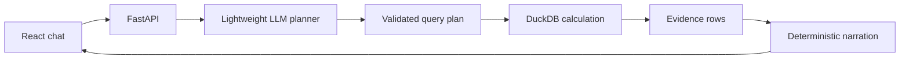

# TBX Finance Assistant

An AI assistant for asking plain-language questions about financial operations data and receiving accurate, traceable answers. Built for the **TBX - BVP Tech Catalyst Hackathon**.

Start with the [documentation map](docs/README.md). For the complete component breakdown, request flow, design rationale, tradeoffs, security analysis and prioritized limitations, read [Architecture Deep Dive](docs/ARCHITECTURE.md).

> **Dataset status:** The final TBX schema is now represented by `bank`, `account`, and `transaction`. The committed rows are synthetic; replace them with the official files without changing the assistant contract.

## What the starter already supports

- Durable, bounded multi-turn history with deterministic follow-up plan merging
- Runtime upload and schema discovery for CSV datasets
- Final-schema semantic views with deterministic bank/account joins
- Account-number masking and complete UTR exclusion from chat and exports
- Model-generated structured query plans constrained to real datasets and columns
- Deterministic filtering, grouping and aggregation with DuckDB
- Plain-language explanations generated only after computation
- Evidence tables containing the underlying records or breakdown
- CSV export for every computed result
- Explicit clarification instead of fabricated figures
- Confidence signalling based on whether matching evidence exists
- Mock mode for developing without API credits
- Replaceable model provider, initially wired for Sarvam AI

The TBX relationship is `bank 1—N account 1—N transaction`. The language model queries only safe semantic views; it never generates joins or sees the raw sensitive columns.

## Included synthetic demo data

`data/sample/` contains a small, deterministic version of the final three-table schema. It is entirely synthetic and is loaded by default through `DATA_DIRECTORY=data/sample`.

Try these immediately in mock mode:

- `How much was debited last month?`
- `Show transactions for bank code HDFC.`
- `Break down available balance by bank.`
- `Find transaction reference ID REF-SYN-0005.`

Mock mode uses a deliberately small rule-based planner for these acceptance paths. It exists for local plumbing tests, not as the final natural-language model.

Generate a larger deterministic dataset without extra dependencies:

```bash
python scripts/generate_dummy_data.py --accounts 10000 --transactions 1000000
```

Then set `DATA_DIRECTORY=data/generated`. Generated data is gitignored. Capacity
assumptions and scaling thresholds are documented in
[Capacity Estimation](docs/architecture/CAPACITY_ESTIMATION.md).

## Grounded request flow



The language model never calculates totals or writes the final figures. It maps the question to a constrained `QueryPlan`; the backend validates dataset and column names, parameterizes filter values, runs the calculation, reconciles grouped evidence, and renders the answer deterministically. The server retains only the latest 12 compact messages and the last validated plan. Evidence rows are never copied into conversational memory.

## Repository structure

```text
frontend/                 React + TypeScript chat and evidence UI
backend/app/api/          Chat, upload, catalog and export endpoints
backend/app/assistant/    Planning and grounded explanation workflow
backend/app/data/         Schema discovery and deterministic query engine
backend/app/providers/    Mock and Sarvam model adapters
backend/app/tools/        Extension point for problem-specific tools
backend/tests/            Guardrail and computation tests
data/uploads/             Runtime TBX files; contents are gitignored
```

## Start locally

Prerequisite: Docker Desktop with the Docker engine running.

```bash
git clone https://github.com/MenigStar91/tbx-ai-assistant.git
cd tbx-ai-assistant
cp .env.example .env
docker compose up --build
```

Open the UI at http://localhost:5173, API docs at http://localhost:8000/docs,
health endpoint at http://localhost:8000/api/v1/health, and the judge-friendly
system contract at http://localhost:8000/api/v1/info.

The default `LLM_PROVIDER=mock` requires no API key and demonstrates the grounded path with a basic count plan. For meaningful natural-language planning, configure the model selected after TBX shares its model-efficiency guidance.

## Configure Sarvam AI

Set these values in `.env` without committing the file:

```env
LLM_PROVIDER=sarvam
SARVAM_API_KEY=your_key
SARVAM_MODEL=sarvam-105b
```

The provider interface is deliberately replaceable. The final lightweight model should be chosen only after the model-efficiency scoring note and capped credits are provided. A locally hosted model can be added as another `LLMProvider` without changing the assistant workflow.

## Load the TBX starter dataset

Use **Upload TBX CSV files** in the UI or call:

```bash
curl -X POST http://localhost:8000/api/v1/datasets/upload \
  -F 'files=@bank.csv' \
  -F 'files=@account.csv' \
  -F 'files=@transaction.csv'
```

Inspect the discovered catalog at `GET /api/v1/datasets`. Uploaded contents are excluded from Git. If TBX supplies Excel files, add an Excel-to-CSV adapter in `backend/app/data/catalog.py`; the query and assistant layers remain unchanged.

## Sample questions for the final submission

These are acceptance-test prompts from the stated scope. Actual answers must be captured only after running them against the official dataset.

1. How much was debited last month?
2. Break down available balance by bank.
3. Show transactions for HDFC Bank.
4. Find transaction reference ID REF-SYN-0005.
5. Show transactions for the account ending in 2345.
6. Export that breakdown as CSV.

Do not place placeholder numeric answers in the final presentation. Save the exact question, generated query plan, evidence and response from a reproducible run.

## Evaluation alignment

| Criterion | Implementation |
|---|---|
| Accuracy and grounding | Allowlisted query plans, parameterized filters and deterministic DuckDB computation |
| Model efficiency | Replaceable provider; model choice deferred until official scoring guidance arrives |
| Natural-language understanding | Model translates intent, filters, dates and follow-up context into structured plans |
| Functionality | Chat, upload, query, evidence and export endpoints |
| User experience | Evidence shown inline with confidence and one-click CSV export |
| Explainability | Dataset, calculation summary, columns and source rows returned with every answer |
| Hallucination control | Missing data, invalid columns and ambiguous questions return clarification rather than a number |

The final model scorecard measures answer accuracy, exact intent/query-plan
generation, correct refusals, evidence fidelity, tokens and P95 latency. Current
results are deliberately marked pending after the schema change; see
[Model Scorecard](docs/evaluation/MODEL_SCORECARD.md) and [Evaluation Status](EVAL.md).

## Data and reconciliation boundaries

Complex bank/account/transaction questions use fixed semantic joins; the LLM
never generates join SQL. Vendor questions currently identify the missing
vendor mapping. Double-entry reconciliation requires immutable journal lines,
which are not present in the published schema. The required atomic ingest,
quarantine and issue workflow is specified in
[Reconciliation and Ingestion](docs/data/RECONCILIATION.md).

## Hack-day checklist

1. Upload `bank.csv`, `account.csv`, and `transaction.csv` with the documented columns.
2. Check discovered names and types at `/api/v1/datasets`.
3. Add aliases only where the official data dictionary requires them.
4. Benchmark the permitted lightweight model on a fixed question set.
5. Add date-range tests using dates present in the dataset.
6. Capture sample questions, query plans, source records and exact answers.
7. Add anomaly detection only after grounding tests pass.
8. Prepare the required architecture diagram and presentation deck.

To switch from the synthetic files without changing code:

```env
DATA_DIRECTORY=data/uploads
```

Place the official files in `data/uploads/` or upload them through the UI. The synthetic directory remains separate and cannot contaminate official answers.

## Known starter limitations

- CSV input only
- The current adapter expects the final table and column names exactly; aliases belong in `DatasetCatalog`
- UTR plaintext lookup is intentionally unsupported because the source may encrypt it
- In-memory exports expire when the API restarts
- Conversation sessions are keyed by an unguessable UUID; authentication and tenant ownership must be added before production use
- One message produces one query plan; independent multi-question batching is not supported
- Mock mode validates plumbing, not language understanding
- Authentication and multi-tenancy are intentionally excluded by the problem scope
- Model choice and accuracy metrics remain open pending TBX guidance and credits

## Testing

```bash
cd backend
python -m venv .venv
source .venv/bin/activate
pip install -r requirements.txt
pytest -q
```

Tests cover deterministic calculations and refusal to answer without uploaded data. Add golden question-plan-answer cases once the official dataset arrives.

## PR review agent

The repository includes the shared `$tbx-pr-reviewer` skill under `.agents/skills/`. Use it with a GitHub pull request URL or number:

```text
Use $tbx-pr-reviewer to review PR #12.
Use $tbx-pr-reviewer to fix the verified findings in PR #12.
```

Review mode is read-only by default. Fix mode changes only the PR branch after an explicit request, runs relevant verification, and never merges automatically.

## License

Private and confidential. See [LICENSE](LICENSE). Confirm the hackathon's ownership and submission terms before replacing it with an open-source license.
