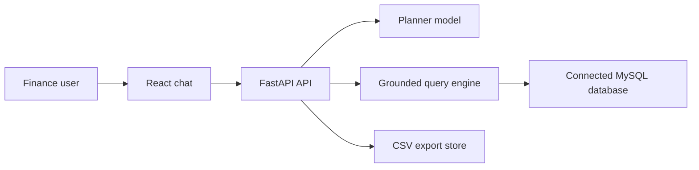
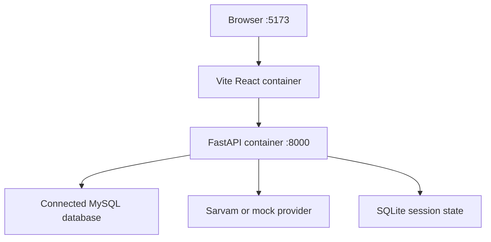
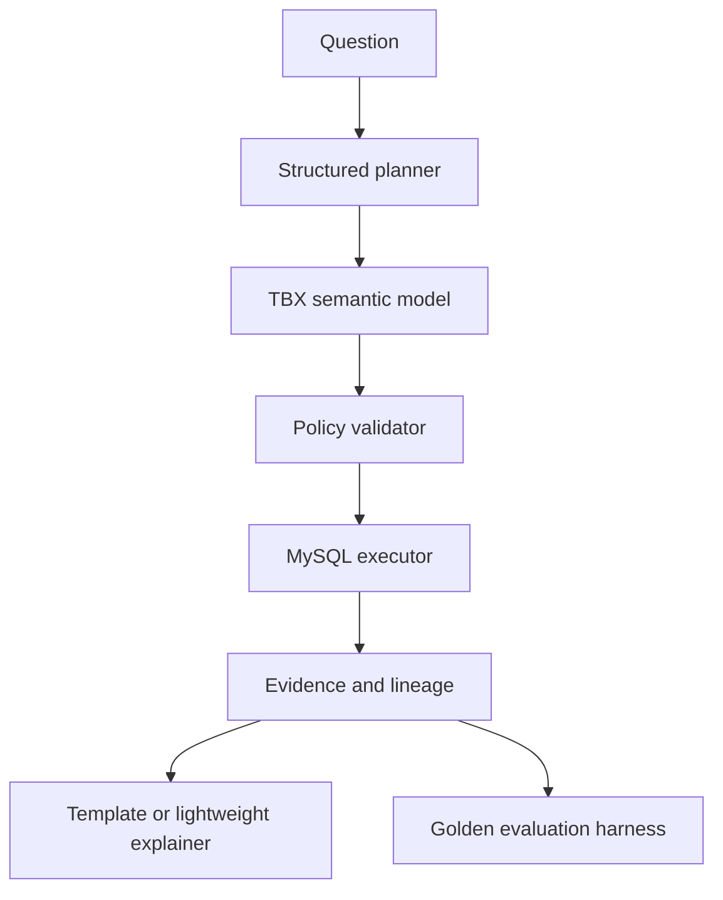

# TBX Finance Assistant - Architecture Deep Dive

## 1. Executive summary

The system is a grounded natural-language interface over a connected MySQL financial database. React sends a question to FastAPI; one lightweight-model call returns a constrained query plan; the backend repairs and validates it against an introspected schema, executes it in MySQL, reconciles the evidence, and narrates the result deterministically.

The central design rule is:

> The model may interpret intent. It may not join data, calculate figures, expose protected fields, or write final numbers.

This is intentionally a **hackathon-ready grounded prototype**, not yet a production financial platform. It optimizes for accuracy, explainability, lightweight deployment and rapid adaptation when TBX supplies the official files.

## 2. Architectural goals and non-goals

### Goals

1. Ground every numeric answer in uploaded data.
2. Keep calculations deterministic and testable.
3. Prevent the model from emitting arbitrary SQL.
4. Show evidence with every successful answer.
5. Isolate the final TBX schema behind replaceable semantic views.
6. Keep the model provider replaceable for the model-efficiency evaluation.
7. Run locally with no model credits through a narrow mock mode.

### Non-goals in the current problem scope

- Live ERP or banking integrations
- Payment execution
- Multi-tenant authorization
- Full accounting semantics
- Arbitrary analytical SQL
- Production-scale ingestion and data governance

## 3. System context



Only FastAPI is externally addressed by the UI. The model cannot access MySQL directly and receives only privacy-filtered schema metadata during planning.

## 4. Container and runtime view



`compose.yaml` launches four local-demo services:

| Service | Present responsibility | Important note |
|---|---|---|
| `web` | Vite development server and React UI | Development server, not a production static build |
| `seed` | Imports `data/uploads/*.csv` into local MySQL | Local sample construction only; not used with the real database |
| `api` | Public endpoints, orchestration, schema cache and MySQL execution | Reload mode is enabled for development |
| `db` | MySQL sample database | Replace with read-only TBX connection settings for the real environment |

The repository's `data/uploads` directory is mounted only for local sample ingestion. In the real environment, the API connects directly using a read-only MySQL account; no production rows are exported into local files.

## 5. Source-code responsibilities

```text
frontend/src/main.tsx              UI state, upload, chat and evidence rendering
backend/app/main.py                FastAPI bootstrapping and CORS
backend/app/api/routes.py          HTTP boundary and dependency construction
backend/app/assistant/service.py   Guarded one-call planning orchestration
backend/app/providers/             Replaceable language-model boundary
backend/app/data/mysql_catalog.py  MySQL introspection and sample CSV ingestion
backend/app/data/catalog.py        Legacy DuckDB fixture used only by unit tests
backend/app/data/query_engine.py   Query validation, SQL construction and execution
backend/app/data/exports.py        Temporary CSV export cache
backend/app/schemas.py             API and internal contract models
backend/app/tools/registry.py      Future deterministic tool extension point
data/uploads/                      Gitignored CSV inputs for local MySQL seeding
```

## 6. End-to-end chat flow


### Stage A - request construction

`frontend/src/main.tsx` creates one UUID session and reuses it across requests and page reloads. The API owns conversation integrity: SQLite stores the latest 12 compact messages and the last validated `QueryPlan`. Evidence rows are deliberately excluded from memory. On a follow-up, filters are inherited, replaced by column, or explicitly removed in deterministic code after model planning. A standalone question never inherits prior filters.

Tradeoff: SQLite is durable and ideal for the single-instance demo, but horizontally scaled production deployments should replace `ConversationStore` with PostgreSQL or Redis behind the same interface. Session UUIDs are not authorization; authenticated tenant ownership is required before production use.

### Stage B - live schema discovery

`MySQLDatasetCatalog.describe()` extracts table, column, type and optional comment metadata from `INFORMATION_SCHEMA`. It caches that contract after the first extraction; `POST /api/v1/datasets/refresh` is the deliberate refresh point after approved DDL changes. It never scans production rows while building the catalog.

For the local sample only, CSV ingestion creates private `source_*` tables and public privacy-safe views. `account_number` becomes `account_last4`; `utr_number` becomes only `utr_available`. The optional TBX bank/account/transaction joins live in those database views, not in model output.

Why this approach:

- The planner sees only tables and columns that exist in the current database.
- Optional column comments improve semantics without being required.
- Large tables are filtered and aggregated inside MySQL rather than copied to the API.
- New schemas are extensible through introspection; cross-table business meaning stays in reviewed views.

Tradeoff: metadata reveals structure, not business meaning. Ambiguous names still need column comments, aliases or an approved semantic view. The cached snapshot avoids per-question extraction but must be refreshed after DDL changes.

### Stage C - planning

`AssistantService` creates a planner prompt containing:

- The user's question
- Up to twelve prior messages
- Today's date for relative date phrases
- The discovered dataset catalog
- The exact JSON structure the model must return

The returned object is parsed into `QueryPlan`:

```json
{
  "dataset": "transaction",
  "operation": "sum",
  "measure": "transaction_amount",
  "group_by": [],
  "filters": [
    {"column": "transaction_type", "operator": "eq", "value": "debit"},
    {"column": "transaction_date", "operator": "gte", "value": "2026-08-01"},
    {"column": "transaction_date", "operator": "lte", "value": "2026-08-31"}
  ],
  "limit": 50
}
```

The model does not return SQL. It chooses values inside a deliberately small analytical DSL.

### Stage D - validation and SQL construction

Validation occurs at two levels:

1. Pydantic restricts operations, filter operators, grouping width and result limit.
2. `GroundedQueryEngine` checks every requested dataset and column against the live catalog.

Identifiers are accepted only after catalog validation and are quoted. Filter values are passed as query parameters. This blocks the ordinary model-to-SQL injection path and prevents arbitrary statements such as `DROP`, joins to hidden tables, or unbounded queries.

Supported operations:

- `list`
- `count`
- `sum`
- `average`
- `minimum`
- `maximum`

Supported filters:

- Equality and inequality
- Greater/less than comparisons
- Case-insensitive substring matching

Supported grouping is limited to three real columns. List plans must explicitly
name their projected columns. Both evidence listings and grouped breakdowns are
bounded by `max_result_rows`; oversized groupings are refused rather than silently
truncated. Broad transaction queries require a date/time comparison, except exact
transaction/reference lookups.

The API connects through `MYSQL_READ_*`, which can point directly at MySQL or at
a TBX read replica without a code change. The local seed container alone uses
`MYSQL_WRITE_*` and provisions the demo read-only user. Each runtime statement is
subject to a session timeout and cost-only `EXPLAIN FORMAT=JSON`. Controlled load
tests may enable `EXPLAIN ANALYZE`; it is off in requests because it executes the
query before the real execution.

### Stage E - evidence generation

MySQL returns the bounded rows and column names. The backend builds an `Evidence` object containing:

- Dataset name
- Returned columns
- Source or aggregated rows
- Returned row count
- Human-readable calculation summary
- Temporary export identifier

The same rows are serialized into CSV and inserted into `ExportStore`.

### Stage F - deterministic narration

`narrate.py` renders a concise answer directly from the validated plan and
computed evidence. A numeral-fidelity tripwire rejects any number that does not
come from the result, filter or row count. This avoids a second model call,
reduces latency and prevents an explainer from changing a correct figure.

Tradeoff: templates are less stylistically flexible than free-form generation.
That is deliberate for financial answers; language-specific templates can be
added without weakening the calculation boundary.

### Stage G - rendering and export

React renders model output as text rather than raw HTML, reducing script-injection risk. Evidence is rendered as a horizontally scrollable table. The export link calls `GET /api/v1/exports/{id}.csv`.

## 7. Provider architecture

`LLMProvider` is a Python protocol with one method:

```python
async def generate(messages: list[Message]) -> ProviderResponse
```

### Sarvam provider

`SarvamProvider` calls the configured chat-completions endpoint through `httpx`, using `api-subscription-key`. The key remains server-side. The rest of the application depends only on the neutral provider interface.

Benefits:

- Easy replacement after TBX publishes its lightweight-model guidance
- No Sarvam-specific DTOs outside one module
- Async I/O and a bounded timeout

Current limitations:

- `sarvam-105b` may not satisfy the scored lightweight-model requirement.
- No streaming, retry/backoff, circuit breaker or rate-limit handling.
- No schema-enforced structured-output API is used; JSON compliance relies on prompting and validation.
- Response-shape changes can currently surface as unhandled key errors.

### Mock provider

Mock mode is not an AI model. It is a deliberately narrow rule-based planner
supporting transaction amount, balance, bank/reference/account-last4 filters,
grouping and `last month` resolution. It proves ingestion, calculation,
evidence and export without credits.

It must not be used for model-accuracy claims.

## 8. Why React + FastAPI + MySQL

| Choice | Why it fits | Tradeoff |
|---|---|---|
| React + TypeScript | Fast interactive chat/table UX, familiar ecosystem | Current UI is a single component and needs decomposition as it grows |
| FastAPI | Strong Python AI/data ecosystem, async APIs, Pydantic contracts, automatic OpenAPI | Less compile-time enforcement than Java; discipline is required at boundaries |
| MySQL + schema introspection | Queries the supplied database directly and lets one code path support evolving schemas | Analytical indexes/read replicas may be required at production volume |
| Pydantic query DSL | Constrains the model and makes plans testable | Narrow expressiveness; complex finance questions need more operators |
| One-call LLM flow | The model interprets intent; deterministic code calculates and narrates | Templates trade prose flexibility for speed and number fidelity |
| Bounded server-side history | Durable refreshes, stable token cost, trusted prior plan | SQLite is single-instance; production needs PostgreSQL/Redis and tenant authorization |
| Provider protocol | Model can change without rewriting orchestration | Lowest-common-denominator interface lacks streaming and structured outputs |

### Why Spring Boot is not in the current request path

This problem is AI- and analytics-first, while authentication, multi-tenancy and transactional command execution are explicitly out of scope. Adding Spring Boot would create another deployment, contract and network boundary without improving the scored grounding path. If the project later executes payments or owns transactional workflows, Spring Boot can become the command/security service while FastAPI remains the analytical assistant.

## 9. Data strategy and replacement of sample data

The synthetic files mirror the final TBX schema and relationships, but contain no TBX-provided records.

```text
data/uploads/   gitignored CSV inputs used only to seed the local MySQL demo
MySQL           authoritative query source for both sample and real environments
```

For the local demo, place CSVs in `data/uploads` and let the `seed` container import them. For the real TBX environment, disable the seed container and configure a read-only MySQL user. Inspect `GET /api/v1/datasets`, confirm the extracted contract, and run golden questions. After approved DDL changes, refresh once through `POST /api/v1/datasets/refresh`.

## 10. Grounding and security boundaries

### What is currently protected

- The model cannot emit arbitrary SQL.
- Dataset and column identifiers must exist in the live catalog.
- Filter values are parameterized.
- Query operations and result limits are allowlisted.
- No model-generated HTML is rendered.
- `.env` and uploaded data are excluded from Git.
- Missing data returns clarification rather than a guessed answer.
- Raw account numbers and UTRs are absent from catalogs, evidence, vocabulary scans and exports.
- Explicit protected-field requests are refused before a model call.
- Aggregate breakdowns are reconciled and answer numerals are verified against evidence.
- The application runtime has SELECT-only credentials; sample ingestion uses separate credentials.
- Transaction scans require time scope, evidence/group rows are capped and costly plans are refused.

### What is not yet protected

- Upload size, row count and decompression/resource limits
- Authentication and access control
- File malware scanning or CSV formula-injection neutralization on export
- Concurrent schema changes while a cached catalog is active
- Prompt-injection content embedded inside financial fields
- Encryption and key management for protected source fields at rest
- Per-user dataset isolation
- Audit-grade lineage and immutable dataset versions

The query DSL limits the blast radius of prompt injection, but it does not guarantee semantic correctness. A model can still choose a valid but wrong column or date range.

## 11. Accuracy model

There are three independent accuracy layers:

1. **Intent accuracy:** Did the planner select the correct dataset, metric, filters and dates?
2. **Computation accuracy:** Did deterministic SQL correctly implement the plan?
3. **Explanation fidelity:** Did the final response faithfully describe the computed evidence?

Evaluation should report these separately. A useful golden test fixture stores the question, expected `QueryPlan`, expected rows and expected answer facts. This makes model comparisons meaningful and helps show why a smaller model is sufficient.

## 12. Current limitations, prioritized

### P0 - required for a credible final demo

1. **No comparison plan.** “Compare with the month before” needs two periods or a time-bucket operator; the DSL supports one query only.
2. **Simplistic confidence.** Confidence is `high` whenever rows exist, even if the planner was uncertain.
3. **Exact header dependency.** The semantic adapter expects the published table and column names.
4. **Encrypted UTR search unsupported.** The assistant refuses it instead of pretending plaintext equality works.
5. **Limited domain semantics.** Debit/credit sign conventions and balance timing still require TBX confirmation.

### P1 - important engineering improvements

1. The schema cache is process-local and requires explicit refresh after DDL changes.
3. Export data is held in one process and disappears on restart; multiple workers would have inconsistent stores.
4. Upload reads the complete file into memory and can overwrite a sanitized filename.
5. `ToolRegistry` and `percentage_change` are injected but not used by `AssistantService`.
6. Errors from malformed provider payloads, MySQL execution and serialization are not handled uniformly.
7. Currency aggregation has no guard against summing mixed currencies.
8. Nulls, refunds, negative amounts and duplicate transaction IDs have no explicit semantics.

### P2 - production hardening

- Shared multi-replica conversation/session storage
- Background ingestion jobs
- Dataset versioning and lineage
- Metrics, tracing and structured logs
- Rate limiting and quotas
- Static frontend build behind a production web server
- Model response caching
- Horizontal-worker-safe export storage
- Secret manager integration
- Accessibility and richer loading/error states

## 13. Recommended next architecture



The semantic layer now defines safe joins and protected projections. The next improvement is to version that contract and add TBX-confirmed debit/credit, balance-as-of, duplicate and reversal semantics.

For larger read-heavy workloads, retain the planner and policy contracts while
routing approved analytical views to a columnar replica or warehouse. That is a
production scaling option, not another service required for the hackathon demo.

## 14. Testing strategy

### Unit tests

- Every DSL operation and filter
- Identifier rejection and parameter binding
- Date boundaries, leap years and month transitions
- Empty results, null values, decimals and negative amounts
- Currency partitioning

### Contract tests

- Each provider returns parseable plans or a clarification
- Upload/catalog response schemas remain stable
- Evidence and export contain identical rows

### Golden evaluation suite

For each representative question, store:

- Expected intent
- Expected plan
- Expected deterministic result
- Required facts in the deterministic narration
- Whether clarification is expected
- Model tokens, latency and cost

This suite directly supports the hackathon's accuracy and model-efficiency scoring.

### End-to-end tests

- Upload files, ask a question, inspect evidence and download CSV
- Follow-up question reusing prior context
- Missing dataset and ambiguous question behavior
- Provider timeout and invalid JSON behavior

## 15. Decision summary

The current design is strong where the problem is scored most heavily: it creates a hard boundary between probabilistic interpretation and deterministic finance calculations, and it makes source rows visible. Its greatest weakness is analytical expressiveness, not framework choice. The priority on hack day should therefore be the TBX semantic model, joins/comparisons and a measured lightweight-model evaluation—not adding more infrastructure.
