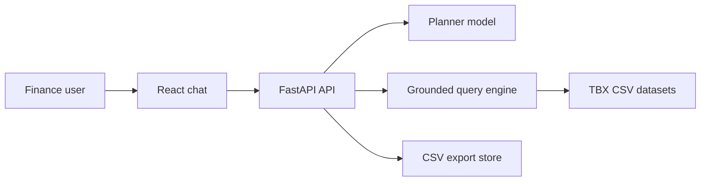
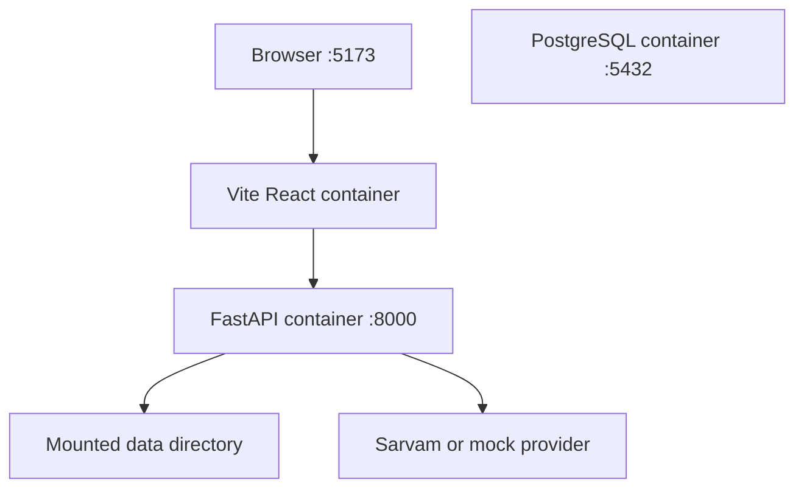
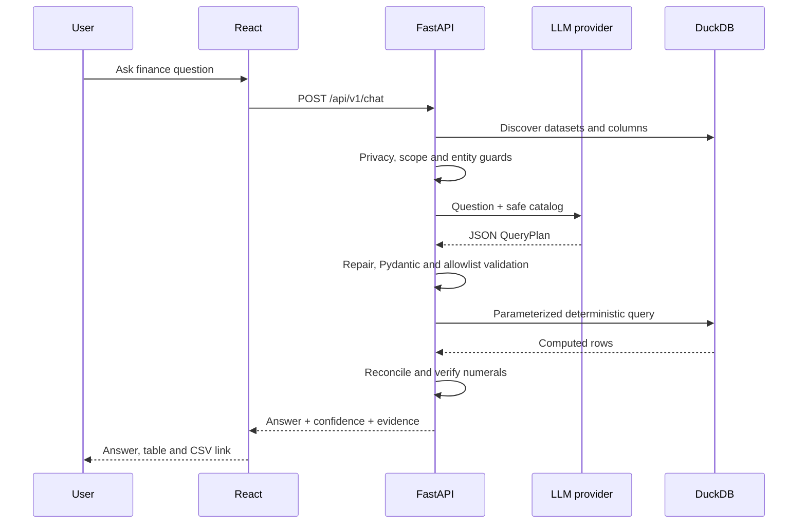

# TBX Finance Assistant - Architecture Deep Dive

## 1. Executive summary

The system is a grounded natural-language interface over the final TBX bank, account and transaction schema. React sends a question to FastAPI; one lightweight-model call returns a constrained query plan; the backend repairs and validates it, executes it in DuckDB, reconciles the evidence, and narrates the result deterministically.

The central design rule is:

> The model may interpret intent. It may not join data, calculate figures, expose protected fields, or write final numbers.

This is intentionally a **hackathon-ready grounded prototype**, not yet a production financial platform. It optimizes for accuracy, explainability, lightweight deployment and rapid adaptation when TBX supplies the official files.

## 2. Architectural goals and non-goals

### Goals

1. Ground every numeric answer in uploaded data.
2. Keep calculations deterministic and testable.
3. Prevent the model from emitting arbitrary SQL.
4. Show evidence with every successful answer.
5. Isolate the final TBX schema behind replaceable semantic views.
6. Keep the model provider replaceable for the model-efficiency evaluation.
7. Run locally with no model credits through a narrow mock mode.

### Non-goals in the current problem scope

- Live ERP or banking integrations
- Payment execution
- Multi-tenant authorization
- Full accounting semantics
- Arbitrary analytical SQL
- Production-scale ingestion and data governance

## 3. System context



Only FastAPI is externally addressed by the UI. The model cannot access files or DuckDB directly and receives only safe metadata during planning.

## 4. Container and runtime view



`compose.yaml` currently launches three services:

| Service | Present responsibility | Important note |
|---|---|---|
| `web` | Vite development server and React UI | Development server, not a production static build |
| `api` | Public endpoints, orchestration and DuckDB execution | Reload mode is enabled for development |
| `db` | PostgreSQL 16 | Provisioned for future persistence but currently unused |

The repository's `data/` directory is mounted at `/app/data`. `.env` selects `data/sample` today. On hack day, setting `DATA_DIRECTORY=data/uploads` isolates official files from synthetic ones.

## 5. Source-code responsibilities

```text
frontend/src/main.tsx              UI state, upload, chat and evidence rendering
backend/app/main.py                FastAPI bootstrapping and CORS
backend/app/api/routes.py          HTTP boundary and dependency construction
backend/app/assistant/service.py   Guarded one-call planning orchestration
backend/app/providers/             Replaceable language-model boundary
backend/app/data/catalog.py        CSV discovery and protected semantic views
backend/app/data/query_engine.py   Query validation, SQL construction and execution
backend/app/data/exports.py        Temporary CSV export cache
backend/app/schemas.py             API and internal contract models
backend/app/tools/registry.py      Future deterministic tool extension point
data/sample/                       Synthetic TBX-shaped development data
```

## 6. End-to-end chat flow



### Stage A - request construction

`frontend/src/main.tsx` sends the new message and prior conversation. For assistant messages that had evidence, it includes a compact grounded context containing the dataset, calculation summary and up to ten prior rows. This is how follow-up questions can retain context without server-side session storage.

Tradeoff: this is simple and stateless, but the browser becomes responsible for conversation integrity and request size grows with history. It also means evidence included in history is sent to the external model.

### Stage B - live schema discovery

`DatasetCatalog.describe()` registers source CSVs as private `_source_*` views and exposes three public views: `bank`, `account`, and `transaction`. The latter two perform fixed foreign-key joins. `account_number` becomes `account_last4`; `utr_number` becomes only `utr_available`.

Why this approach:

- The final TBX relationships are implemented in one adapter rather than prompted into the model.
- DuckDB reads CSV directly and infers common types.
- The planner sees only datasets and columns that actually exist.
- No database migration is required for initial files.

Tradeoff: schema inference occurs repeatedly and can infer inconsistent types from imperfect files. Production ingestion should validate files once, persist a versioned catalog and reject schema drift explicitly.

### Stage C - planning

`AssistantService` creates a planner prompt containing:

- The user's question
- Up to twelve prior messages
- Today's date for relative date phrases
- The discovered dataset catalog
- The exact JSON structure the model must return

The returned object is parsed into `QueryPlan`:

```json
{
  "dataset": "transaction",
  "operation": "sum",
  "measure": "transaction_amount",
  "group_by": [],
  "filters": [
    {"column": "transaction_type", "operator": "eq", "value": "debit"},
    {"column": "transaction_date", "operator": "gte", "value": "2026-08-01"},
    {"column": "transaction_date", "operator": "lte", "value": "2026-08-31"}
  ],
  "limit": 50
}
```

The model does not return SQL. It chooses values inside a deliberately small analytical DSL.

### Stage D - validation and SQL construction

Validation occurs at two levels:

1. Pydantic restricts operations, filter operators, grouping width and result limit.
2. `GroundedQueryEngine` checks every requested dataset and column against the live catalog.

Identifiers are accepted only after catalog validation and are quoted. Filter values are passed as query parameters. This blocks the ordinary model-to-SQL injection path and prevents arbitrary statements such as `DROP`, joins to hidden tables, or unbounded queries.

Supported operations:

- `list`
- `count`
- `sum`
- `average`
- `minimum`
- `maximum`

Supported filters:

- Equality and inequality
- Greater/less than comparisons
- Case-insensitive substring matching

Supported grouping is limited to three real columns. Results are capped at 200 by the schema, though the configured `max_result_rows` setting is not yet wired into this cap.

### Stage E - evidence generation

DuckDB returns the rows and column names. The backend builds an `Evidence` object containing:

- Dataset name
- Returned columns
- Source or aggregated rows
- Returned row count
- Human-readable calculation summary
- Temporary export identifier

The same rows are serialized into CSV and inserted into `ExportStore`.

### Stage F - deterministic narration

`narrate.py` renders a concise answer directly from the validated plan and
computed evidence. A numeral-fidelity tripwire rejects any number that does not
come from the result, filter or row count. This avoids a second model call,
reduces latency and prevents an explainer from changing a correct figure.

Tradeoff: templates are less stylistically flexible than free-form generation.
That is deliberate for financial answers; language-specific templates can be
added without weakening the calculation boundary.

### Stage G - rendering and export

React renders model output as text rather than raw HTML, reducing script-injection risk. Evidence is rendered as a horizontally scrollable table. The export link calls `GET /api/v1/exports/{id}.csv`.

## 7. Provider architecture

`LLMProvider` is a Python protocol with one method:

```python
async def generate(messages: list[Message]) -> ProviderResponse
```

### Sarvam provider

`SarvamProvider` calls the configured chat-completions endpoint through `httpx`, using `api-subscription-key`. The key remains server-side. The rest of the application depends only on the neutral provider interface.

Benefits:

- Easy replacement after TBX publishes its lightweight-model guidance
- No Sarvam-specific DTOs outside one module
- Async I/O and a bounded timeout

Current limitations:

- `sarvam-105b` may not satisfy the scored lightweight-model requirement.
- No streaming, retry/backoff, circuit breaker or rate-limit handling.
- No schema-enforced structured-output API is used; JSON compliance relies on prompting and validation.
- Response-shape changes can currently surface as unhandled key errors.

### Mock provider

Mock mode is not an AI model. It is a deliberately narrow rule-based planner
supporting transaction amount, balance, bank/reference/account-last4 filters,
grouping and `last month` resolution. It proves ingestion, calculation,
evidence and export without credits.

It must not be used for model-accuracy claims.

## 8. Why React + FastAPI + DuckDB

| Choice | Why it fits | Tradeoff |
|---|---|---|
| React + TypeScript | Fast interactive chat/table UX, familiar ecosystem | Current UI is a single component and needs decomposition as it grows |
| FastAPI | Strong Python AI/data ecosystem, async APIs, Pydantic contracts, automatic OpenAPI | Less compile-time enforcement than Java; discipline is required at boundaries |
| DuckDB | Excellent local analytical SQL over CSV with no server setup | Repeated scans and no durable catalog; not the system of record for production |
| Pydantic query DSL | Constrains the model and makes plans testable | Narrow expressiveness; complex finance questions need more operators |
| One-call LLM flow | The model interprets intent; deterministic code calculates and narrates | Templates trade prose flexibility for speed and number fidelity |
| Stateless chat history | Simple demo deployment | Client-controlled context, no durable sessions, larger requests |
| Provider protocol | Model can change without rewriting orchestration | Lowest-common-denominator interface lacks streaming and structured outputs |

### Why Spring Boot is not in the current request path

This problem is AI- and analytics-first, while authentication, multi-tenancy and transactional command execution are explicitly out of scope. Adding Spring Boot would create another deployment, contract and network boundary without improving the scored grounding path. If the project later executes payments or owns transactional workflows, Spring Boot can become the command/security service while FastAPI remains the analytical assistant.

## 9. Data strategy and replacement of sample data

The synthetic files mirror the final TBX schema and relationships, but contain no TBX-provided records.

```text
data/sample/    committed synthetic data
data/uploads/   gitignored official or locally uploaded data
```

On hack day:

1. Set `DATA_DIRECTORY=data/uploads`.
2. Add or upload the official files.
3. Inspect `GET /api/v1/datasets`.
4. Confirm inferred types and the fixed bank/account foreign-key joins.
5. Add aliases in the semantic adapter only if delivered headers differ.
6. Run golden questions before changing prompts.

Changing the directory is trivial. The joins and privacy projection remain deterministic; the model continues to target the same public contract.

## 10. Grounding and security boundaries

### What is currently protected

- The model cannot emit arbitrary SQL.
- Dataset and column identifiers must exist in the live catalog.
- Filter values are parameterized.
- Query operations and result limits are allowlisted.
- No model-generated HTML is rendered.
- `.env` and uploaded data are excluded from Git.
- Missing data returns clarification rather than a guessed answer.
- Raw account numbers and UTRs are absent from catalogs, evidence, vocabulary scans and exports.
- Explicit protected-field requests are refused before a model call.
- Aggregate breakdowns are reconciled and answer numerals are verified against evidence.

### What is not yet protected

- Upload size, row count and decompression/resource limits
- Authentication and access control
- File malware scanning or CSV formula-injection neutralization on export
- Concurrent replacement of a CSV during a query
- Prompt-injection content embedded inside financial fields
- Encryption and key management for protected source fields at rest
- Per-user dataset isolation
- Audit-grade lineage and immutable dataset versions

The query DSL limits the blast radius of prompt injection, but it does not guarantee semantic correctness. A model can still choose a valid but wrong column or date range.

## 11. Accuracy model

There are three independent accuracy layers:

1. **Intent accuracy:** Did the planner select the correct dataset, metric, filters and dates?
2. **Computation accuracy:** Did deterministic SQL correctly implement the plan?
3. **Explanation fidelity:** Did the final response faithfully describe the computed evidence?

Evaluation should report these separately. A useful golden test fixture stores the question, expected `QueryPlan`, expected rows and expected answer facts. This makes model comparisons meaningful and helps show why a smaller model is sufficient.

## 12. Current limitations, prioritized

### P0 - required for a credible final demo

1. **No comparison plan.** “Compare with the month before” needs two periods or a time-bucket operator; the DSL supports one query only.
2. **Simplistic confidence.** Confidence is `high` whenever rows exist, even if the planner was uncertain.
3. **Exact header dependency.** The semantic adapter expects the published table and column names.
4. **Encrypted UTR search unsupported.** The assistant refuses it instead of pretending plaintext equality works.
5. **Limited domain semantics.** Debit/credit sign conventions and balance timing still require TBX confirmation.

### P1 - important engineering improvements

1. The catalog reopens CSV files per query; only metadata and vocabulary scans are cached.
3. Export data is held in one process and disappears on restart; multiple workers would have inconsistent stores.
4. Upload reads the complete file into memory and can overwrite a sanitized filename.
5. PostgreSQL and `DATABASE_URL` are unused while the API waits for the database container.
6. `ToolRegistry` and `percentage_change` are injected but not used by `AssistantService`.
7. `max_result_rows` is configured but not connected to `QueryPlan.limit`.
8. Errors from malformed provider payloads, DuckDB execution and serialization are not handled uniformly.
9. Currency aggregation has no guard against summing mixed currencies.
10. Nulls, refunds, negative payouts and duplicate transaction IDs have no explicit semantics.

### P2 - production hardening

- Durable conversation/session storage
- Background ingestion jobs
- Dataset versioning and lineage
- Metrics, tracing and structured logs
- Rate limiting and quotas
- Static frontend build behind a production web server
- Model response caching
- Horizontal-worker-safe export storage
- Secret manager integration
- Accessibility and richer loading/error states

## 13. Recommended next architecture


The semantic layer now defines safe joins and protected projections. The next improvement is to version that contract and add TBX-confirmed debit/credit, balance-as-of, duplicate and reversal semantics.

## 14. Testing strategy

### Unit tests

- Every DSL operation and filter
- Identifier rejection and parameter binding
- Date boundaries, leap years and month transitions
- Empty results, null values, decimals and negative amounts
- Currency partitioning

### Contract tests

- Each provider returns parseable plans or a clarification
- Upload/catalog response schemas remain stable
- Evidence and export contain identical rows

### Golden evaluation suite

For each representative question, store:

- Expected intent
- Expected plan
- Expected deterministic result
- Required facts in the deterministic narration
- Whether clarification is expected
- Model tokens, latency and cost

This suite directly supports the hackathon's accuracy and model-efficiency scoring.

### End-to-end tests

- Upload files, ask a question, inspect evidence and download CSV
- Follow-up question reusing prior context
- Missing dataset and ambiguous question behavior
- Provider timeout and invalid JSON behavior

## 15. Decision summary

The current design is strong where the problem is scored most heavily: it creates a hard boundary between probabilistic interpretation and deterministic finance calculations, and it makes source rows visible. Its greatest weakness is analytical expressiveness, not framework choice. The priority on hack day should therefore be the TBX semantic model, joins/comparisons and a measured lightweight-model evaluation—not adding more infrastructure.
