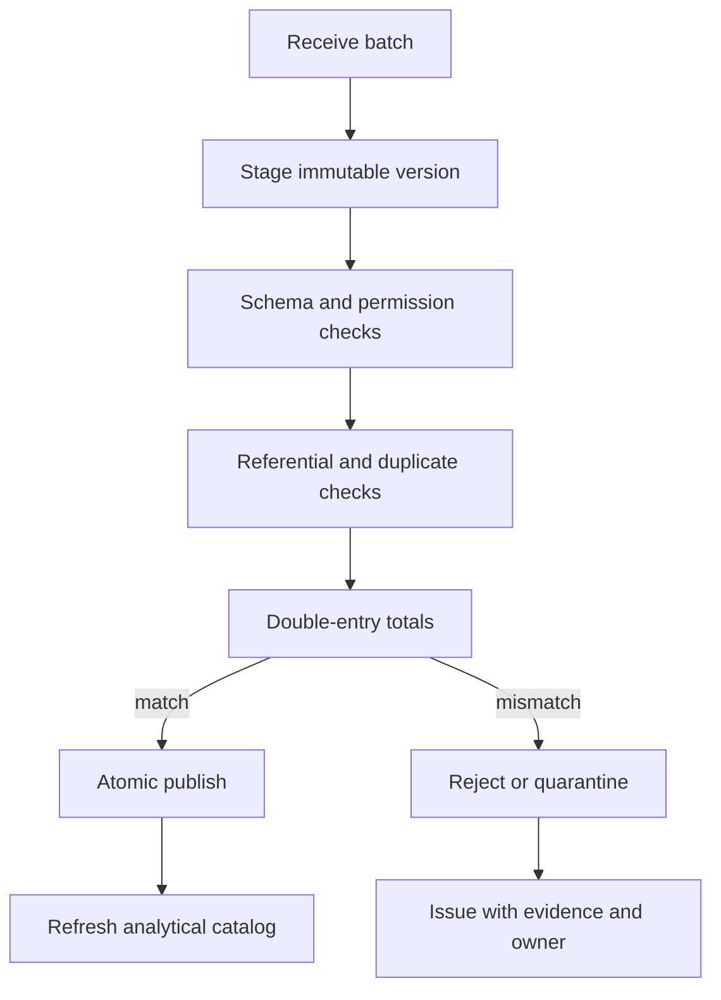

# Reconciliation and ingestion orchestration

## Boundary

The published three-table schema contains bank transactions, not accounting
journal lines. It can support analytical totals and referential checks, but it
cannot prove double-entry equality. The assistant therefore refuses certification
until the ledger contract below is available.

## Required ledger contract

Each immutable journal line needs at least:

- `journal_id` and `posting_batch_id`
- `line_id`, `account_id` and `entity_id`
- `debit_amount`, `credit_amount` and `currency`
- `posted_at`, `posting_status` and source reference
- idempotency key and dataset/version identifier

For each `(posting_batch_id, journal_id, currency)`, require
`SUM(debit_amount) = SUM(credit_amount)` using decimal arithmetic.

## Write orchestrator

### Transaction rules

1. Stage the complete batch under a new version; never mutate the active dataset.
2. Validate schema, allowed tenant/entity scope, primary keys and foreign keys.
3. Reject duplicate idempotency keys and conflicting journal versions.
4. Reconcile debit/credit totals per journal and currency.
5. Publish the version and pointer in one transaction only if every check passes.
6. On failure, leave the previous version active and persist the failed batch,
   computed delta and reason in a quarantined reconciliation dataset.
7. Analytics reads only published versions; it never sees half-ingested batches.

“Rollback” therefore means the active version never advances. A downstream bank
transaction mismatch should open an exception for investigation, not rewrite an
immutable posted journal without an approved reversal.

## Analytics remains primary

Reconciliation status becomes another grounded analytical dimension once the
authoritative dataset exists. The chat orchestration stays read-only: it may
explain mismatches and evidence, but must never post, reverse or approve entries.
